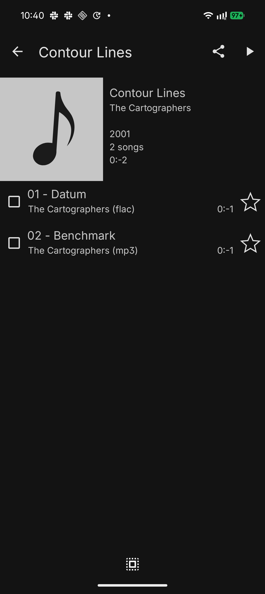
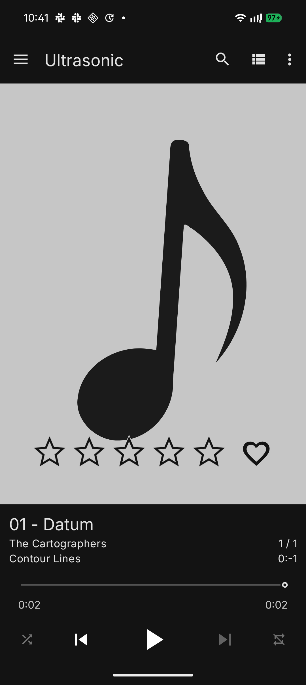
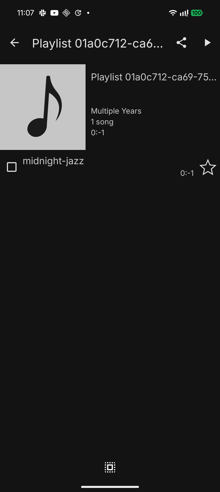
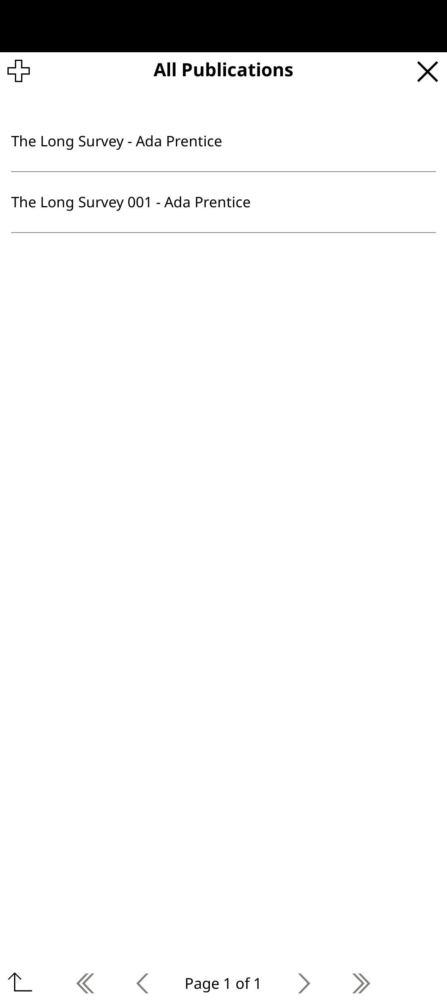
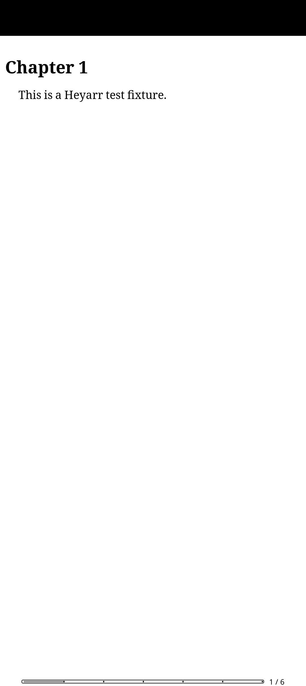

# App-in-the-loop acceptance for the compatibility adapters

`make demo` proves the OpenSubsonic and OPDS adapters are **protocol-conformant on a
real byte path**: it authenticates, browses, and streams or downloads, and asserts the
bytes are byte-identical to the blob route's. What it cannot prove is the honest far
end of the bar — a **real third-party app**, code this project did not write, browsing
and playing. That is app-in-the-loop, it needs a device and a person, and it is out of
the 300s demo budget by the same reasoning that keeps the real video client out of M2's
demo (#202).

This file is where those passes are recorded. The scene is reproducible:
`scripts/real-app-acceptance.sh` stands up a disposable node with the ordinary fixture
library, binds it to TCP, and prints what to type into the app — so a pass is a
procedure against a known library rather than an anecdote about somebody's own.

Recording a pass here does **not** flip a claim in `scripts/claims.list` to `proven`.
A `proven` claim names a fixed string that must appear in a `make demo` transcript, and
no phone appears in that transcript. This is the same arrangement the qBittorrent leg
uses (`acquires-over-daemon-clients`, #379): proven out of band, recorded as such, and
left `pending` in the ledger because the merge-path demo genuinely does not prove it.

---

## 2026-09-22 · OpenSubsonic · Ultrasonic 4.9.0 · Android 16 (#373)

**Setup.** `scripts/real-app-acceptance.sh` on `127.0.0.1:7788`; the phone reached it
over `adb reverse tcp:7788 tcp:7788`, so the scene was never exposed to a network.
Four fixture files ingested — a two-track album (one FLAC, one MP3), an EPUB and a CBZ.
Server build `v0.4.10-22-gc079b6c`.

**What the app did, by itself, through its own UI:**

| step | result |
|---|---|
| add server, `Test Connection` | server identified as `heyarr`, OpenSubsonic advertised |
| Artists | `The Cartographers` |
| → artist | album `Contour Lines` (2001) |
| → album | `01 - Datum` (flac), `02 - Benchmark` (mp3) |
| → Play Now | **played to completion**, 0:02 / 0:02 |

Server-side, the same pass, from the node log:

```
/rest/ping.view     200          q= u,c,f,v,p
/rest/getArtists    200   300 B  q= u,p,c,v,f
/rest/getUser.view  200   194 B  q= username,u,c,f,v,p
/rest/stream.view   200 32455 B  q= id,u,c,f,v,p
```

The 32455 bytes `stream.view` served is the exact size of the FLAC blob the album's
first track resolves to — the app played the file, not a placeholder.




### Two things only a real app could show

**1. Every stock client sends the salted-token scheme first, and the adapter refuses
it.** By design — the refusal is deliberate and its message is good:

```
{"status":"failed","error":{"code":40,
 "message":"salted-token authentication is not supported; configure this client to send the password directly"}}
```

But the app does not show that message to the user. Ultrasonic's `Test Connection`
answered with an ordinary "Supported features" dialog listing optional features as
absent, which reads like success. The pass needed **Force plain password
authentication** switched on in the server's advanced settings, and nothing in the app
says so. That is not a bug this repository can fix in code — it is a deployment fact
that belongs in the docs, and `scripts/real-app-acceptance.sh` now prints it.

**2. Durations render as negative times** — `0:-1` per track, `0:-2` for the album,
visible in the screenshots above. The adapter emits `duration` and `bitRate` as
explicit JSON `null`. The demo cannot see this: a null is valid JSON of the right
shape and the byte-identity assertion does not read it. Filed as #604.

### What this pass did not cover

Search, playlists (correctly absent — personal state, §72), transcoding, offline
pinning, and anything on a second client. A pass is one app on one device on one build.

---

## 2026-09-22 · Device gateway · Ultrasonic 4.9.0 · Android 16 (#387)

The gateway's own app-in-the-loop half. The same phone and the same stock app, pointed
at `heyarr device gateway` instead of at the controller — which is the arrangement
ADR-0051 exists for: the app sees its playlists, and the controller cannot read them.

**Setup.** One controller (the scene above, still running) plus a gateway on the
laptop, tunnelled to the phone with `adb reverse tcp:4041 tcp:4041`:

```
heyarr device gateway --device-dir <dev> \
  --addr http://127.0.0.1:7788 --controller-url http://127.0.0.1:7788 \
  --device-user stockapp --listen 127.0.0.1:4041
```

The device was enrolled, minted a personal space, and pushed one item:
`heyarr space put <space> --item midnight-jazz`.

**What the stock app showed, from its own Playlists screen:**

| step | result |
|---|---|
| Playlists | one playlist, `1 song` |
| → open it | **`midnight-jazz`** |
| Media Library → Artists | `The Cartographers` — proxied from the controller |



**And the controller held none of it.** The change it stored is 201 opaque bytes, and
nothing under its data directory contains the plaintext:

```
$ heyarr space changes <space> --json | jq -r '.[0].ciphertext' | base64 -d | grep midnight-jazz
(no match — 201 bytes, OPAQUE)
$ grep -rl midnight-jazz <controller data dir>
(nothing)
```

### The two credentials are genuinely distinct

The app authenticates to the *device* with a Subsonic password; the device
authenticates to the *controller* with its bearer. Pointing the app at the gateway with
the **controller's** token as its password is refused:

```
{"status":"failed","error":{"code":40,"message":"wrong username or password"}}
```

That is the separation ADR-0051 claims, observed rather than asserted.

### Finding: the playlist has no name, so a stock app shows a UUID

The screenshot's title is `Playlist 01a0c712-ca69-75fa-aaac-4cd0e858f3b2`. A space
carries no name by design — the peer stores the kind and nothing else (§38) — so the
gateway synthesises a display name from the space id. That is correct about the
invariant and unusable in a real library of more than one playlist. The name is
personal state and belongs *inside* the encrypted CRDT, which is where the fix has to
go. Filed as #605.

---

## 2026-09-22 · OPDS · KOReader v2026.07.1 · Android 16 (#376)

**Setup.** The same scene and the same tunnel (`adb reverse tcp:7788 tcp:7788`); the
catalogue added in KOReader's own *OPDS catalog* screen as
`http://127.0.0.1:7788/opds`, username `realapp`, password the bearer token.

**What the reader did:**

| step | result |
|---|---|
| open the catalogue | 401 Basic challenge answered, navigation feed rendered: `All Publications` |
| → All Publications | `The Long Survey - Ada Prentice`, `The Long Survey 001 - Ada Prentice` |
| → download | EPUB, 2744 bytes, saved by the reader |
| → Read now | **the book opened and rendered** |




**Byte identity, three ways.** The file the reader downloaded, the file on disk that
was ingested, and the bytes the ordinary blob route serves are the same:

```
phone copy:  ddd8097e9c869ffd8b17f539ca112804ce2b8992d5eb54fa35dcd93aaa2f4420
source file: ddd8097e9c869ffd8b17f539ca112804ce2b8992d5eb54fa35dcd93aaa2f4420
blob route:  ddd8097e9c869ffd8b17f539ca112804ce2b8992d5eb54fa35dcd93aaa2f4420
```

The demo already asserts the second and third agree. This pass adds the first — a
reader we did not write, over the wire, onto a device.

### Finding: every OPDS request is preceded by a HEAD that gets 405

KOReader probes each feed with `HEAD` before `GET`, and the OPDS routes answer only
`GET`:

```
HEAD /opds                 405   route "unmatched"
GET  /opds                 200
HEAD /opds/publications    405   route "unmatched"
GET  /opds/publications    200
```

It is harmless here — KOReader ignores the 405 and proceeds — but `route: "unmatched"`
means these are not reaching the OPDS handler at all, so a client that *did* treat a
405 as fatal would see the catalogue as broken. `HEAD` on a `GET` route is free in
`net/http` (the body is discarded); this is a routing registration, not a handler.
Filed as #606.

### A note for whoever repeats this

`adb shell input text` **silently drops underscores** in KOReader's own keyboard, so a
bearer token typed that way arrives subtly wrong and the catalogue fails with
`Authentication required` — which reads exactly like a server-side auth bug and is not
one. Type the password by hand, or write it into `koreader/settings/opds.lua`.
